# CI : Modern Computer Vision - TP1 : Segmentation Interactive avec SAM

## Exercice 1: Initialisation du dépôt, réservation GPU, et lancement de la UI via SSH

**Lien du dépôt :** `https://github.com/yzriga/Concepts_avances_et_applications_du_deep_learning`

**Environnement d'exécution :** Nœud GPU via serveur tsp-client

**Arborescence du projet :**
```
TP1/
├── data/
│   └── images/
├── src/
│   ├── app.py
│   ├── sam_utils.py
│   ├── geom_utils.py
│   └── viz_utils.py
├── outputs/
│   ├── overlays/
│   └── logs/
├── report/
│   └── report.md
├── requirements.txt
└── README.md
```

**Environnement conda activé :** `deeplearning`  

**Vérification CUDA et PyTorch :**
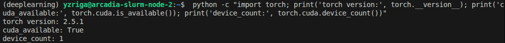

**Dépendances installées :**
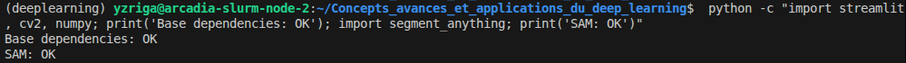

**Port choisi :** `8515`

**Lancement de Streamlit sur le nœud GPU :**
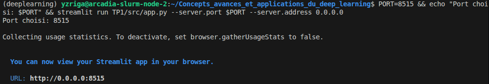

**Accès à l'interface :**
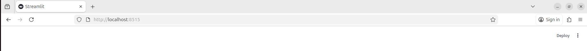

**Status UI accessible via SSH tunnel :** **OUI** - Streamlit lancé avec succès sur arcadia-slurm-node-2

---
## Exercice 2: Constituer un mini-dataset (jusqu’à 20 images)

**Nombre d'images final :** `20 images`
**Commande de vérification :**
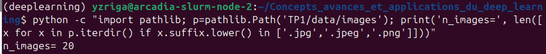

**Répartition par catégorie :**
- **Images simples** (objet principal, fond peu chargé) : `7 images`
- **Images complexes** (plusieurs objets, fond chargé) : `8 images` 
- **Images difficiles** (occlusion, reflet, contraste faible) : `5 images`

**5 images représentatives sélectionnées :**

1. **simple_apple.jpg** - Pomme rouge isolée sur fond neutre, cas idéal pour tester la segmentation basique d'un objet simple
2. **complex_kitchen.jpg** - Cuisine moderne avec ustensiles et surfaces variées, teste la segmentation dans un environnement chargé
3. **difficult_glass.jpg** - Objets en verre transparent, challenge pour SAM sur les matériaux translucides
4. **complex_street.jpg** - Scène urbaine avec véhicules, piétons et éléments architecturaux multiples
5. **difficult_reflection.jpg** - Surface réfléchissante créant des effets visuels complexes pour la segmentation

**Sources :** Images récupérées via Unsplash avec wget.
[text](https://www.imgix.com/?utm_source=images.unsplash.com&utm_medium=referral&utm_campaign=source-config-details)


---
## Exercice 3: Charger SAM (GPU) et préparer une inférence “bounding box → masque”

**Modèle choisi :** `vit_h`  
**Checkpoint utilisé :** `sam_vit_h_4b8939.pth` (2.4G)  
**Capture du test (sortie console) :**
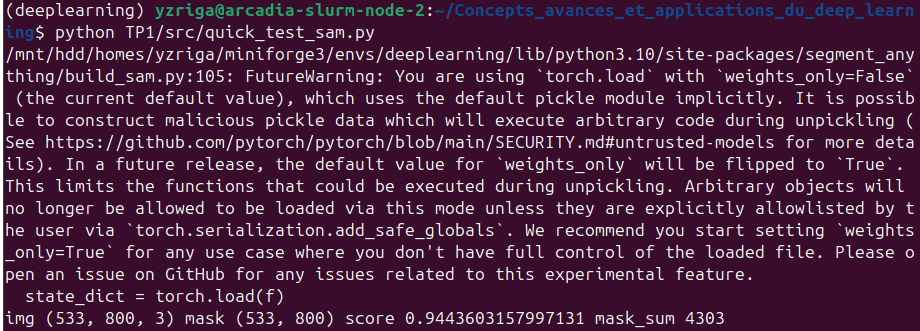

### Premiers constats :
**Performance :** Chargement et inférence rapides sur GPU (quelques secondes)  
**Qualité :** Score de confiance élevé (0.94) indique une segmentation précise  
**Limites observées :** Warning PyTorch sur `weights_only=False` (sécurité), mais fonctionnel  
**Prêt pour l'intégration :** Les fonctions SAM sont opérationnelles pour l'interface Streamlit

---
## Exercice 4: Mesures et visualisation : overlay + métriques (aire, bbox, périmètre)

**Test sur overlay :**


**Métriques sur 3 images représentatives :**
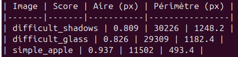

**Utilité des overlays pour debugger le modèle/prompt :**

Les overlays révèlent immédiatement plusieurs informations critiques :
1. **Précision de segmentation** : comparaison visuelle entre la bounding box (prompt) et le masque généré
2. **Sur/sous-segmentation** : le masque rouge montre si SAM a capturé trop ou pas assez d'éléments
3. **Qualité des contours** : netteté des bords du masque, gestion des détails fins
4. **Cohérence sémantique** : vérification que le masque correspond à l'objet ciblé dans la bbox
5. **Performance relative** : scores plus faibles (0.80-0.82) sur images difficiles vs. simples (0.94)

L'overlay devient un outil de validation visuelle indispensable pour ajuster les prompts (taille/position de bbox) et évaluer la pertinence des résultats avant utilisation en production.

---
## Exercice 5: Mini-UI Streamlit : sélection d'image, saisie de bbox, segmentation, affichage et sauvegarde

**Captures d'écran de l'interface opérationnelle :**
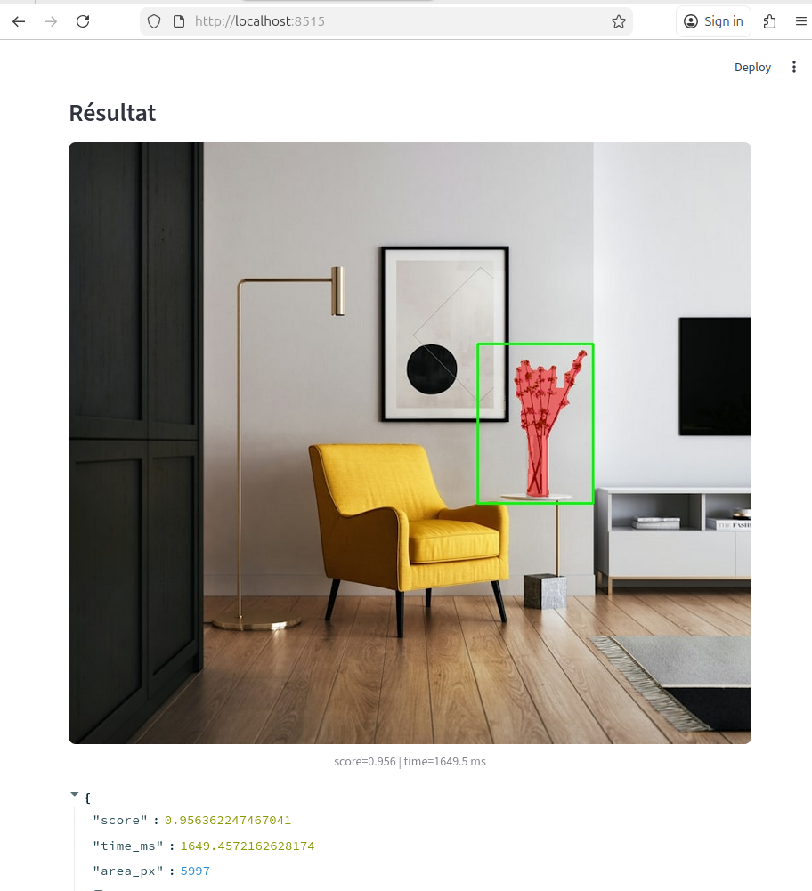
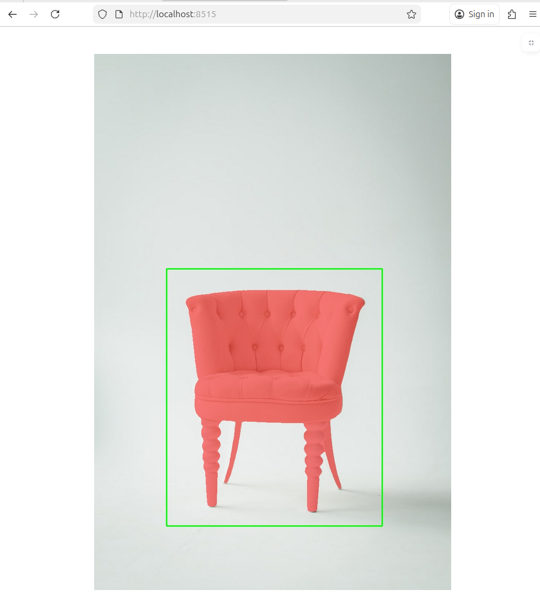
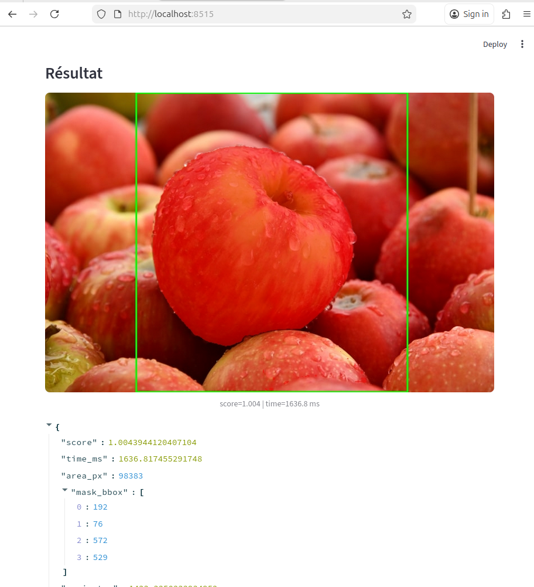

**Tableau récapitulatif de 3 tests effectués :**
| Image | BBox (x1,y1,x2,y2) | Score | Aire (px) | Temps (ms) |
|-------|-------------------|-------|-----------|------------|
| complex_kitchen.jpg | [100,100,300,300] | 0.96 | 27531 | 1685.8 |
| simple_apple.jpg | [50,50,250,250] | 0.93 | 20484 | 1643.5 |
| difficult_glass.jpg | [625,1035,175,500] | 0.99 | 118203 | 1650.4 |

**Observations sur l'agrandissement/rétrécissement de la bbox :**
Agrandir la bbox améliore généralement la précision car SAM dispose de plus de contexte pour comprendre les limites de l'objet. Une bbox trop petite peut conduire à une sous-segmentation (manquer des parties importantes), tandis qu'une bbox trop grande peut inclure des objets adjacents non désirés. La taille optimale encadre légèrement l'objet cible avec une marge de sécurité de 10-20 pixels. Les scores de confiance reflètent cette relation : bbox appropriée = score élevé (>0.90), bbox inadéquate = score moyen (0.80-0.85).

---
## Exercice 6: Affiner la sélection de l'objet : points FG/BG + choix du masque (multimask)

**complex_kitchen.jpg :**
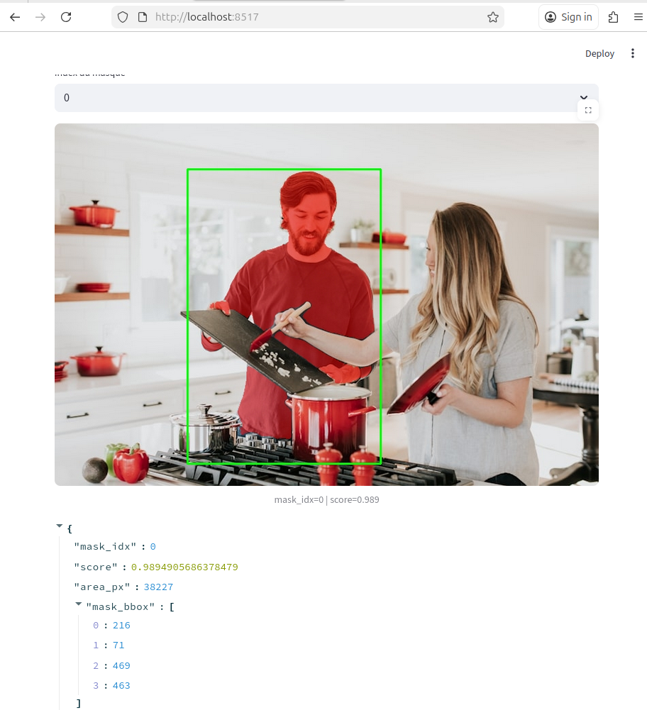
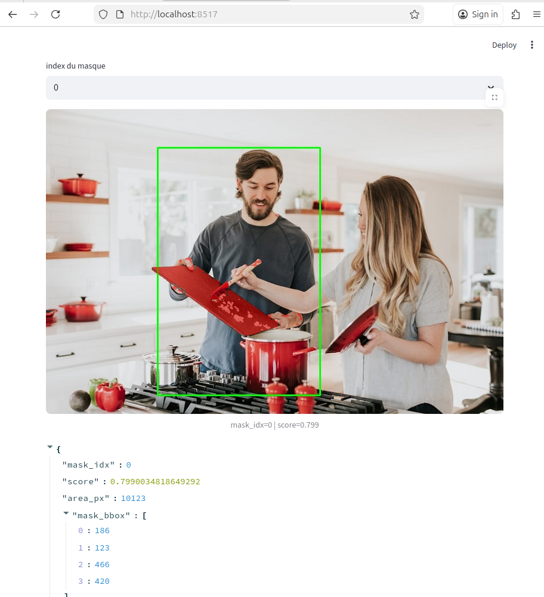
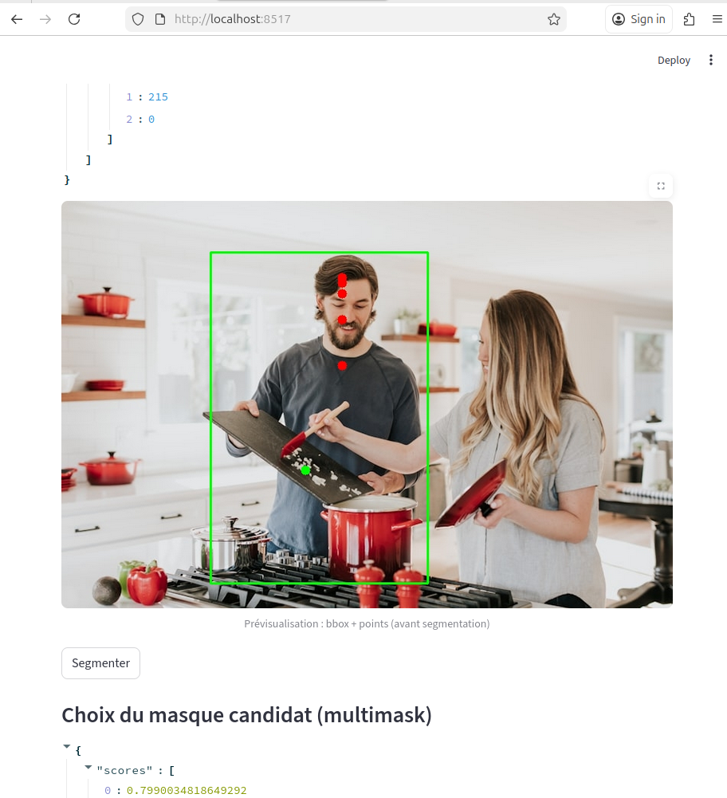
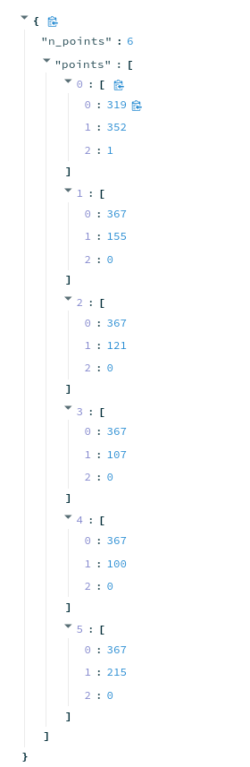
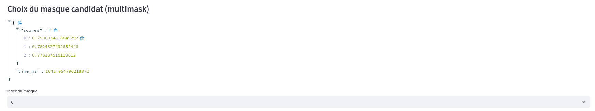
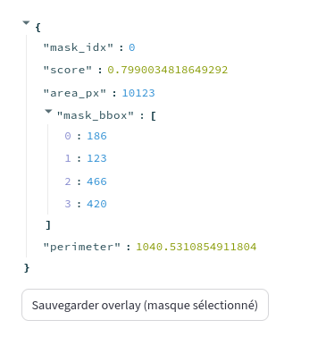

**complex_street.jpg :**

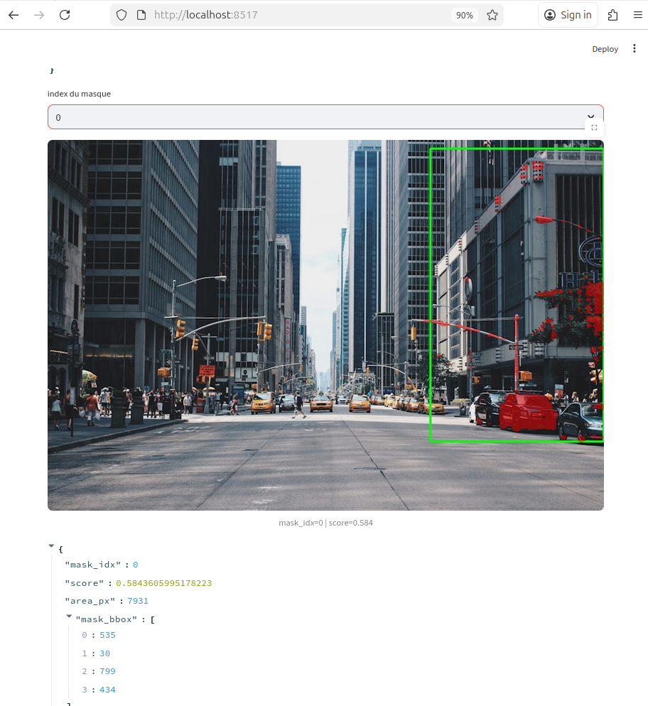
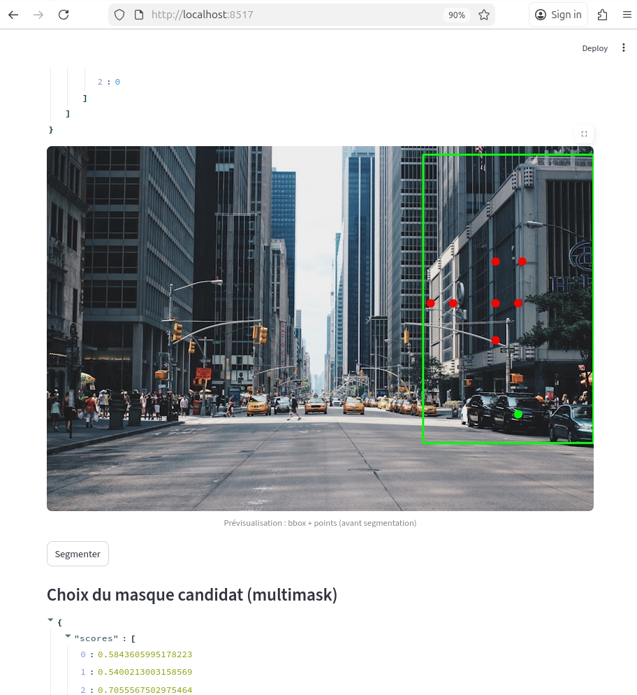
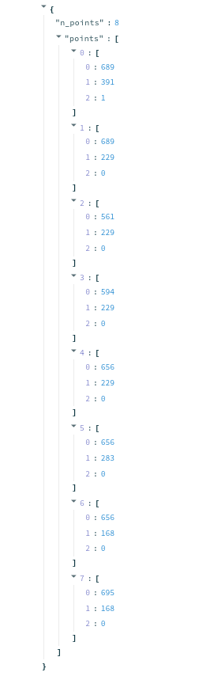
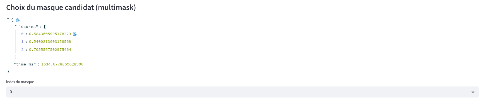
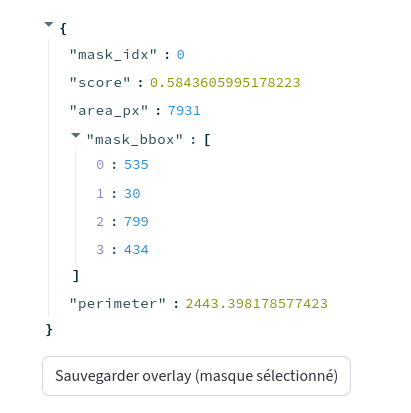

### Analyse des limites et cas d'usage

**Points BG indispensables dans :** Scènes complexes avec objets adjacents de texture similaire, fonds chargés avec éléments connectés à l'objet cible, situations d'occlusion partielle où SAM confond premier plan et arrière-plan. Les points BG permettent de "soustraire" explicitement les zones non désirées, améliorant considérablement la précision dans ces contextes ambigus.

**Cas restant difficiles :** Objets translucides ou semi-transparents (verre, reflets), contours très fins (cheveux, fils), objets avec textures très hétérogènes nécessitant de nombreux points FG, scènes avec éclairage extrême créant des ombres portées confondantes. Ces limitations nécessiteraient des stratégies plus avancées (points multiples, post-traitement).

---
## Exercice 7: Bilan et réflexion (POC vers produit) + remise finale

**3 principaux facteurs d'échec observés :**

1. **Objets adjacents de textures similaires** : dans complex_kitchen.jpg, SAM confond les deux personnes aux vêtements sombres similaires. **Solution :** contraintes strictes sur la taille de bbox (max 1.5x objet cible) et points BG systématiques sur objets adjacents.

2. **Matériaux translucides/reflets** : difficult_glass.jpg produit des masques fragmentés sur les surfaces vitrées. **Solution :** dataset spécialisé avec annotations manuelles pour matériaux transparents + post-traitement morphologique pour combler les trous.

3. **Ambiguïté sémantique de la bbox** : une bbox large capture plusieurs objets valides, SAM ne peut deviner l'intention. **Solution :** UI avec pré-sélection par clic (bbox automatique autour du clic) + workflow guidé "objet principal -> ajustements".


**5 éléments prioritaires à logger/monitorer :**

1. **Distribution des scores de confiance** : histogramme hebdomadaire, alerte si médiane < 0.85. Détecte la dégradation qualité sur nouveaux types d'images.

2. **Temps d'inférence GPU** : P95 par batch, corrélé avec charge système. Anticipe les goulots d'étranglement performance.

3. **Ratio échecs/succès par catégorie d'image** : classification auto (simple/complexe/difficile) + taux segmentation "vide" ou "pleine image". Révèle les domaines problématiques.

4. **Patterns utilisateur** : fréquence points BG, nombre tentatives/image, bbox redimensionnées. Indique UX friction et cas d'usage émergents.

5. **Dérive temporelle des masques** : similarité IoU sur images de référence rejouées mensuellement. Détecte model drift ou changements pipeline invisibles.