# TP2 - CI : Génération d'image

## Exercice 1: Mise en place & smoke test (GPU + Diffusers)

**Image générée :**
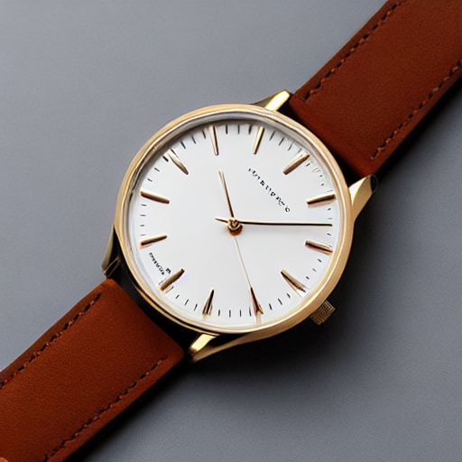

- Aucun problème OOM ou CUDA rencontré

---
## Exercice 2: Factoriser le chargement du pipeline (text2img/img2img)

**Image générée :**
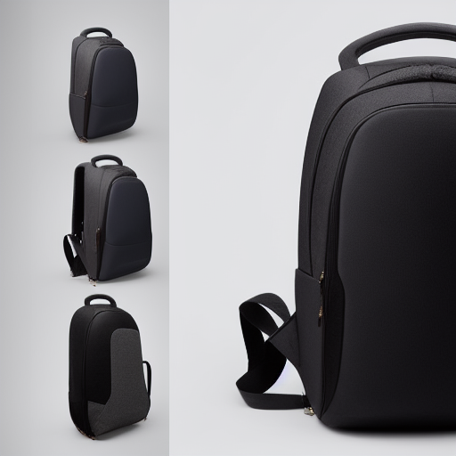

**Configuration baseline :**
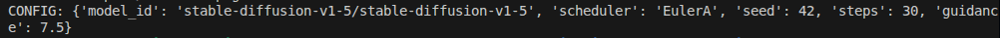

---
## Exercice 3: Text2Img : 6 expériences contrôlées (paramètres steps, guidance, scheduler)

**Grille de résultats :**

| Run01 - Baseline (EulerA, 30 steps, guidance 7.5) | Run02 - Steps15 (15 steps) |
|---|---|
|  | 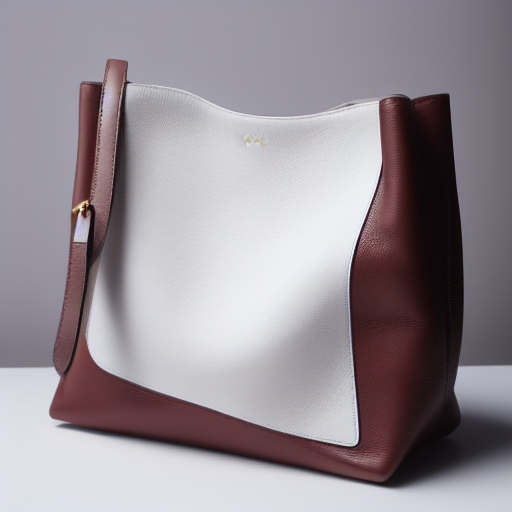 |

| Run03 - Steps50 (50 steps) | Run04 - Guidance4 (guidance 4.0) |
|---|---|
|  | 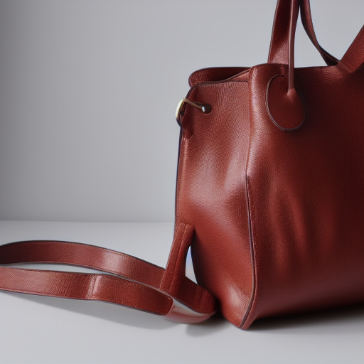 |

| Run05 - Guidance12 (guidance 12.0) | Run06 - DDIM (scheduler DDIM) |
|---|---|
| 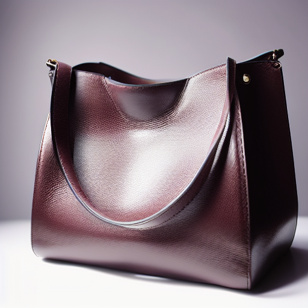 |  |

**Observations qualitatives :**

**Effet des steps (15 vs 30 vs 50) :**
- **15 steps :** Image plus granuleuse, détails moins affinés, convergence incomplète
- **30 steps :** Bon compromis qualité/temps, détails nets, textures réalistes  
- **50 steps :** Raffinement marginal, sur-optimisation possible, temps 2x plus long

**Effet du guidance (4.0 vs 7.5 vs 12.0) :**
- **Guidance 4.0 :** Interprétation plus libre du prompt, créativité accrue, moins de contraste
- **Guidance 7.5 :** Équilibre optimal fidélité/naturalisme, respect du prompt
- **Guidance 12.0 :** Sur-saturation des couleurs, artefacts possibles, rigidité excessive

**Effet du scheduler (EulerA vs DDIM) :**
- **EulerA :** Rendu plus naturel, transitions fluides, meilleur pour produits e-commerce
- **DDIM :** Style légèrement différent, peut produire des variations intéressantes
- **Performance :** Vitesse similaire (~7.8 it/s) pour 30 steps

---
## Exercice 4: Img2Img : 3 expériences contrôlées (strength faible/moyen/élevé)

**Image source vs transformations :**

| Image Source (baseline handbag) | Strength 0.35 (faible) |
|---|---|
| 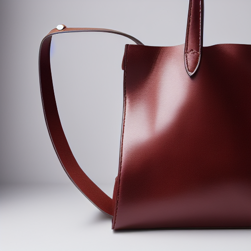 | 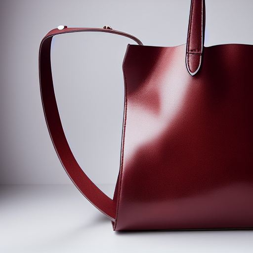 |

| Strength 0.60 (moyen) | Strength 0.85 (élevé) |
|---|---|
| 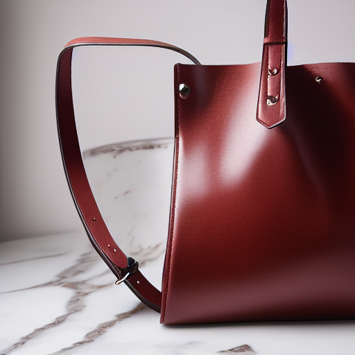 | 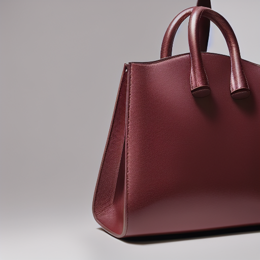 |

**Analyse :**

**Ce qui est conservé :**
- **Strength 0.35 :** Structure générale handbag, forme principale, position globale, cadrage identique
- **Strength 0.60 :** Silhouette reconnaissable, concept produit préservé, certaines proportions
- **Strength 0.85 :** Notion de "sac" reste, mais forme et détails très altérés

**Ce qui change :**
- **Strength 0.35 :** Textures affinées, éclairage légèrement modifié, détails surface handbag
- **Strength 0.60 :** Matériaux transformés (cuir -> autres textures), arrière-plan modifié, style général
- **Strength 0.85 :** Transformation majeure : couleur, matière, forme, éclairage complètement repensés

**Utilisabilité e-commerce :**
- **Strength 0.35 :** **Optimal** - Améliore qualité sans dénaturer, garde identité produit
- **Strength 0.60 :** **Modéré** - Variations intéressantes mais peut s'éloigner trop du produit original
- **Strength 0.85 :** **Risqué** - Transformation trop importante, produit non reconnaissable

---
## Exercice 5: Mini-produit Streamlit (MVP) : Text2Img + Img2Img avec paramètres

### Captures d'écran
**Text2Img mode :**
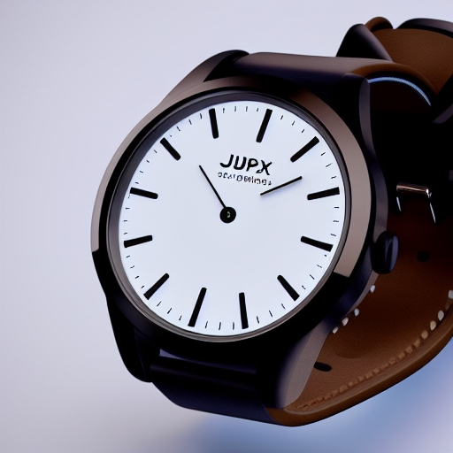
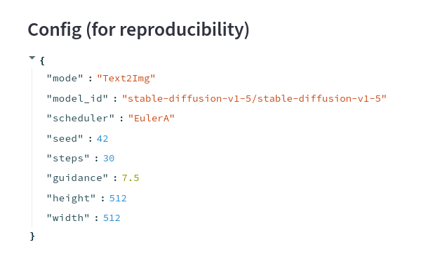

**Img2Img mode :**

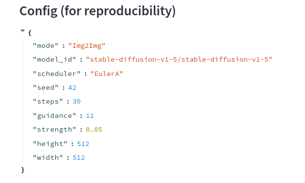

---
## Exercice 6: Évaluation (léger) + réflexion

### Évaluations

#### **Image 1 : Text2Img Baseline (run01_baseline)**
**Configuration :** EulerA, 30 steps, guidance 7.5, seed 42

**Scores :**
- Prompt adherence : **2/2** - Handbag leather parfaitement généré selon prompt
- Visual realism : **2/2** - Qualité photographique excellente, éclairage réaliste
- Artifacts : **2/2** - Aucun artefact visible, surfaces nettes
- E-commerce usability : **2/2** - Directement utilisable, fond neutre, cadrage optimal
- Reproducibility : **2/2** - Tous paramètres documentés

**Total : 10/10**

**Justifications :**
- Image de référence parfaite pour e-commerce, respect total du prompt
- Qualité professionnelle avec éclairage studio et fond blanc clean
- Configuration optimale (30 steps, guidance 7.5) permet reproduction exacte

#### **Image 2 : Text2Img Guidance extrême (run05_guid12)**
**Configuration :** EulerA, 30 steps, guidance 12.0, seed 42

**Scores :**
- Prompt adherence : **2/2** - Handbag bien généré mais sur-contraste
- Visual realism : **1/2** - Sur-saturation visible, couleurs artificielles
- Artifacts : **1/2** - Contours trop nets, sur-processing évident
- E-commerce usability : **1/2** - Utilisable mais nécessite retouches couleur importantes
- Reproducibility : **2/2** - Paramètres documentés

**Total : 7/10**

**Justifications :**
- Guidance 12.0 crée une sur-saturation nuisible au réalisme
- Produit reconnaissable mais rendu trop artificiel pour usage direct
- Démontre l'importance de rester dans guidance 6.0-8.0 pour e-commerce

#### **Image 3 : Img2Img strength élevé (run09_strength085)**
**Configuration :** EulerA, 30 steps, guidance 7.5, strength 0.85, seed 42

**Scores :**
- Prompt adherence : **1/2** - Transformation trop importante, s'éloigne du produit original
- Visual realism : **2/2** - Qualité visuelle excellente
- Artifacts : **2/2** - Aucun artefact, rendu propre
- E-commerce usability : **0/2** - Produit méconnaissable, inutilisable pour vente
- Reproducibility : **2/2** - Paramètres complets

**Total : 7/10**

**Justifications :**
- Strength 0.85 transforme trop le produit original (perte identité)
- Qualité technique parfaite mais échec fonctionnel e-commerce
- Confirme que strength > 0.7 = risque de dérive produit inacceptable

### Réflexion

Le **compromis qualité vs latence/coût** est déterminant en production : nos tests montrent que 15 steps donnent déjà des résultats acceptables (1.5s vs 3.5s pour 30 steps), permettant une économie de 57% de temps GPU. Le scheduler EulerA offre le meilleur rapport qualité/vitesse pour l'e-commerce, tandis que 50 steps n'apportent qu'un gain marginal pour un coût doublé. 

La **reproductibilité** exige un contrôle strict : seed, model_id, scheduler, steps, guidance, et strength (img2img) sont tous nécessaires. Le moindre changement de version de diffusers ou de plateforme peut casser la reproductibilité, nécessitant un versioning rigoureux des environnements.

Les **risques e-commerce** sont critiques : à strength=0.85, le handbag devient méconnaissable (faux produit), guidance>10 crée des artefacts trompeurs, et les negative prompts insuffisants génèrent logos/texte parasites. Pour limiter ces risques, j'implémenterais : validation automatique des outputs (détection logo/texte), bornes strictes sur strength (0.2-0.6), guidance (6.0-8.0), et révision humaine systématique avant publication. L'IA doit rester un outil d'aide, jamais de remplacement total du contrôle qualité e-commerce.

---