# TP3 - CI : Deep learning pour audio

## Exercice 1: Initialisation du TP3 et vérification de l'environnement

### Résultats obtenus
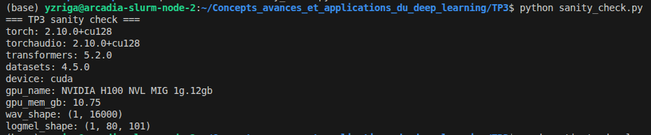

---
## Exercice 2: Constituer un mini-jeu de données : enregistrement d’un “appel” (anglais) + vérification audio

### Vérification des métadonnées

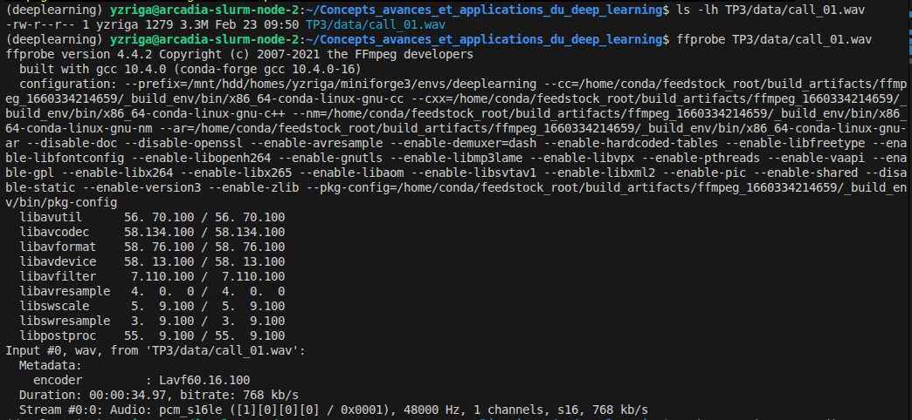

### Résultats d'inspect_audio.py

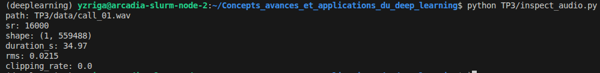

---
## Exercice 3: VAD (Voice Activity Detection) : segmenter la parole et mesurer speech/silence

### Commande utilisée

```bash
pip install silero-vad
```

### Exécution du VAD

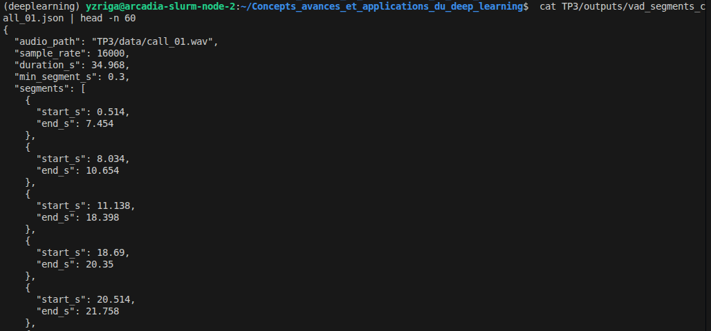

### Analyse speech/silence

Le ratio de parole de **0.847** est cohérent avec une lecture continue à voix claire. Les 10 segments reflètent bien la structure naturelle du texte : les grands blocs (ex. 0.51->7.45s, 11.14->18.40s, 23.68->30.43s) correspondent aux phrases longues, tandis que les 3 courts segments en fin d'enregistrement (≈0.60s chacun) correspondent aux chiffres du numéro de téléphone « 5 5 5 0 1 9 9 » prononcés séparément. Le VAD est bien calibré : pas de micro-segments parasites, les pauses naturelles entre phrases sont correctement détectées comme silence.

### Ajustement du seuil min_dur_s

Pour un filtrage plus strict :

```python
min_dur_s = 0.60
```

En passant de 0.30 à 0.60, `num_segments` reste à 10 et `speech_ratio` est inchangé : tous les segments détectés ont déjà une durée ≥ 0.604s. Le filtrage à 0.30s était déjà suffisamment sélectif sur cet enregistrement.

---
## Exercice 4: ASR avec Whisper : transcription segmentée + mesure de latence

### Exécution — model_id, elapsed_s, rtf

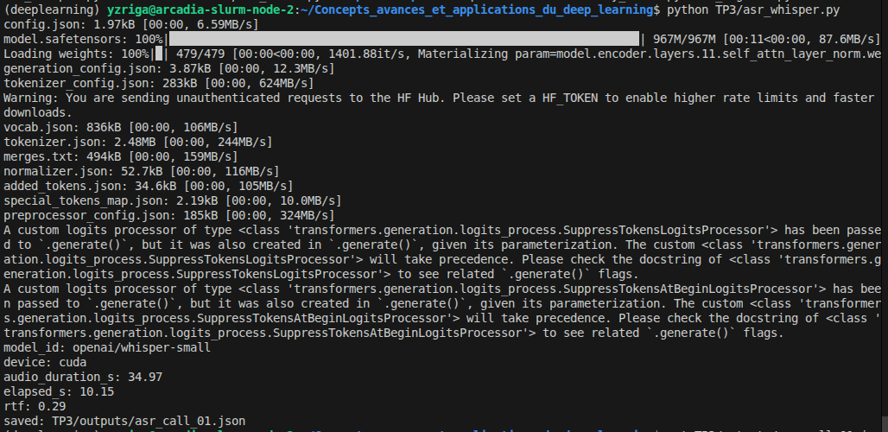

### Extrait JSON — segments et full_text

5 premiers segments :

```json
{ "segment_id": 0, "start_s": 0.514,  "end_s": 7.454,  "text": "Hello, thank you for calling customer support. My name is Alex and I will help you today." },
{ "segment_id": 1, "start_s": 8.034,  "end_s": 10.654, "text": "I'm calling about an order that arrived damaged." },
{ "segment_id": 2, "start_s": 11.138, "end_s": 18.398, "text": "The package was delivered yesterday, but the screen is cracked. I would like refund or replacement as soon as possible." },
{ "segment_id": 3, "start_s": 18.69,  "end_s": 20.35,  "text": "The order number is A." },
{ "segment_id": 4, "start_s": 20.514, "end_s": 21.758, "text": "X19." }
```

full_text :

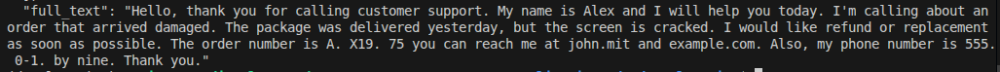

### Analyse VAD + transcription

La segmentation VAD aide globalement la transcription : les segments longs (0–3) sont très bien transcrits, avec ponctuation et majuscules correctes. En revanche, elle nuit sur les éléments épelés : le numéro de commande "AX19735" a été découpé en trois segments courts (3, 4, 5 -> "A.", "X19.", "75"), empêchant Whisper de reconstituer le token complet. Même constat pour le numéro de téléphone (segments 7–8 -> "0-1.", "by nine." au lieu de "0199"). Le segment 6 montre aussi une erreur sur l'email : "john.mit and example.com" au lieu de "john dot smith at example dot com".

---
## Exercice 5: Call center analytics : redaction PII + intention + fiche appel

### Résultats de l'exécution initiale

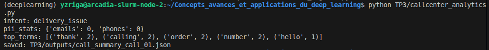

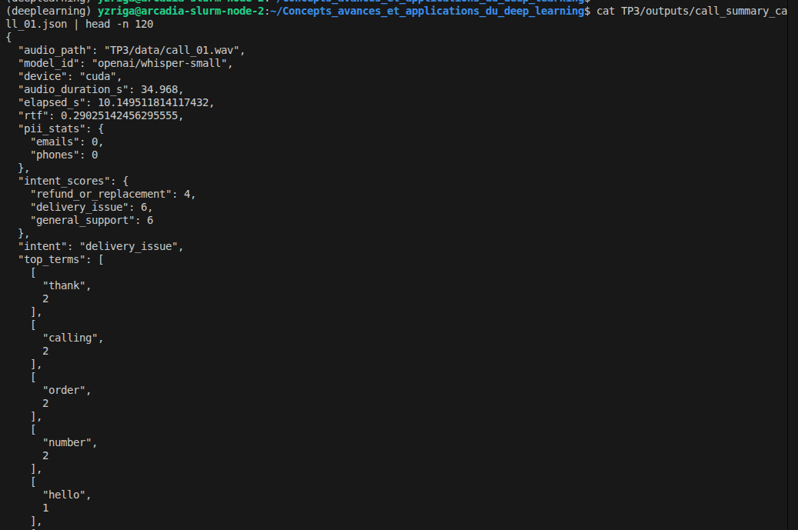

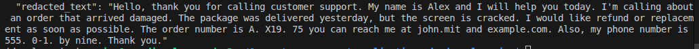

### Post-traitement amélioré

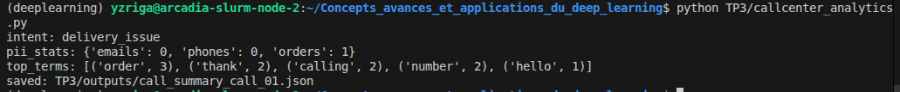

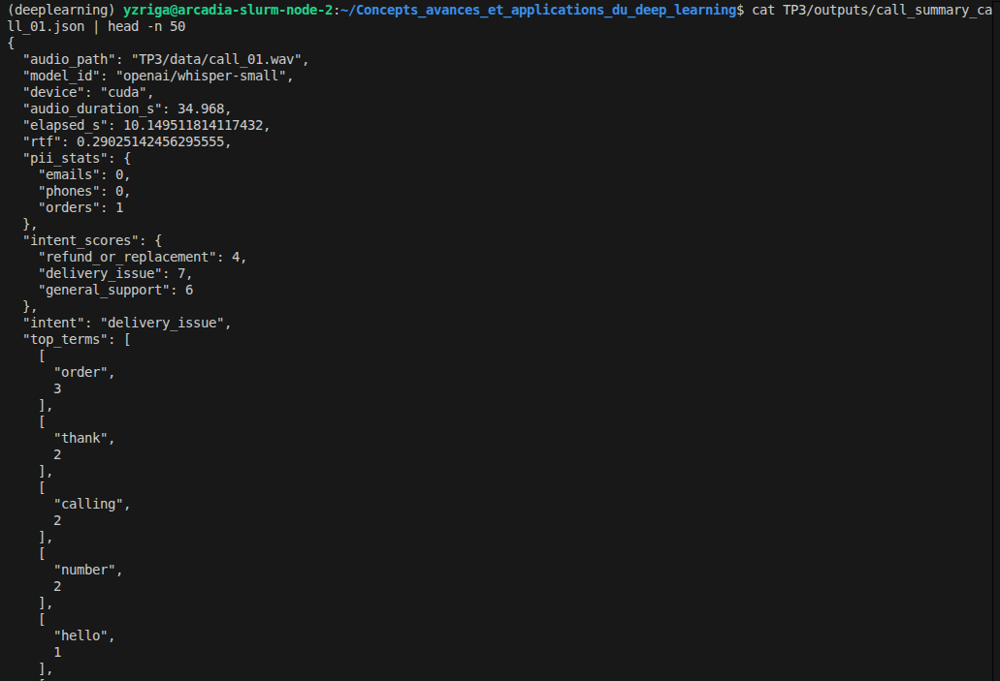

### Comparaison v1 / v2

| Métrique | v1 (sans post-traitement) | v2 (avec post-traitement) |
|----------|--------------------------|--------------------------|
| `emails` | 0 | 0 |
| `phones` | 0 | 0 |
| `orders` | — | 1 |
| `intent` | delivery_issue | delivery_issue |
| `delivery_issue` score | 6 | 7 |

**Progrès v2 :** le numéro de commande est maintenant détecté (`orders: 1`) grâce au pattern contextuel `"order number is ..."`. L'email et le téléphone restent non détectés : Whisper a trop altéré leur forme ("john.mit and example.com", "0-1.", "by nine.") pour que même le post-traitement puisse les rattraper.

### Réflexion

Les erreurs les plus critiques concernent les informations structurées comme le numéro de commande, l’email ou le téléphone, surtout lorsqu’elles sont dictées caractère par caractère, ce qui les rend difficiles à exploiter sans correction automatique. L’intention du message est en général mieux reconnue, car les mots-clés importants comme “refund” ou “damaged” sont correctement transcrits. Cependant, si deux catégories ont le même score, un seul mot-clé manquant peut inverser la décision. Cela montre la fragilité d’un système basé uniquement sur le comptage de mots. En production, il faut donc pondérer les mots selon leur impact métier, car rater une demande de remboursement est bien plus grave qu’une erreur sur un simple “thank you”.

---
## Exercice 6: TTS léger : générer une réponse “agent” et contrôler latence/qualité

### Exécution de tts_reply.py

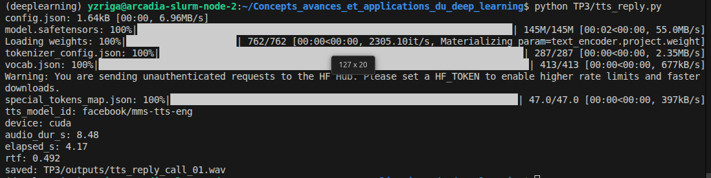

### Métadonnées du WAV généré

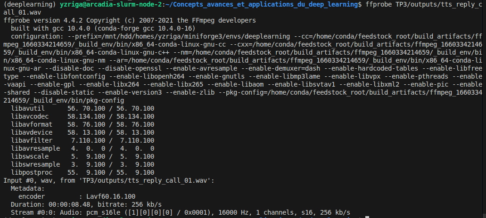

### Observation qualité TTS

Le modèle `facebook/mms-tts-eng` produit une synthèse globalement intelligible : toutes les phrases sont prononcées dans le bon ordre et les mots courants sont bien articulés. La prosodie est plate et uniforme (rythme monotone sans accentuation émotionnelle). Une rupture parasite est perceptible entre "arrived" et "damaged" : Whisper a transcrit "arrived. Demaged" au lieu de "arrived damaged", trahissant soit une micro-pause soit une légère misprononciation du mot par le modèle TTS. Aucun artefact métallique notable n'est détecté. Avec un RTF de **0.492**, la génération prend ~4 s pour 8.5 s d'audio (~2× plus rapide que le temps réel), ce qui est compatible avec une utilisation en production quasi-temps réel.

### Vérification intelligibilité via ASR

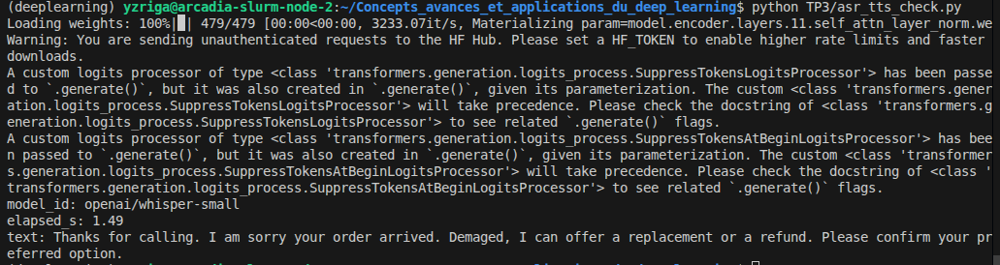

**Comparaison source / ASR :**

| | Texte |
|---|---|
| **Source** | Thanks for calling. I am sorry your order arrived **damaged**. I can offer a replacement or a refund. Please confirm your preferred option. |
| **ASR (Whisper-small)** | Thanks for calling. I am sorry your order arrived. **Demaged**, I can offer a replacement or a refund. Please confirm your preferred option. |

Seule différence notable : "arrived damaged" -> "arrived. Demaged", la pause prosodique introduite par le TTS a trompé Whisper, qui a coupé la phrase et retranscrit "damaged" en "Demaged". Tous les autres mots sont correctement retranscrits, ce qui confirme une intelligibilité élevée.

---
## Exercice 7: Intégration : pipeline end-to-end + rapport d’ingénierie (léger)