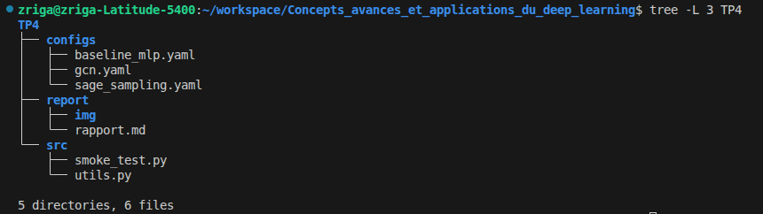
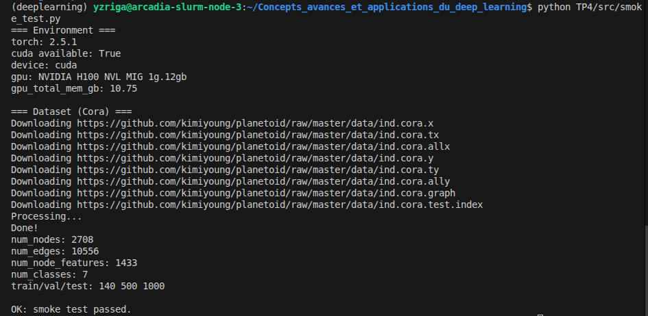
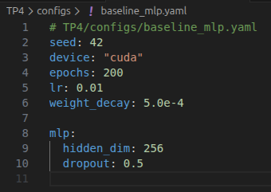
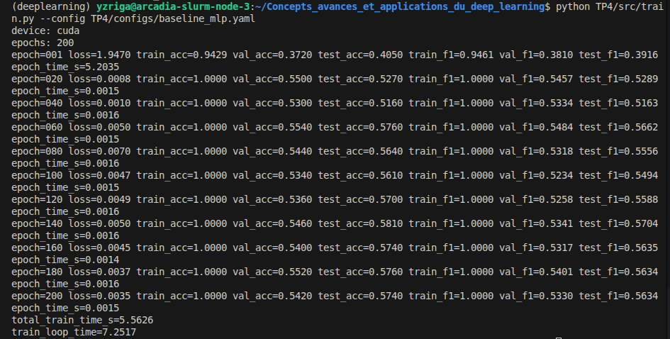
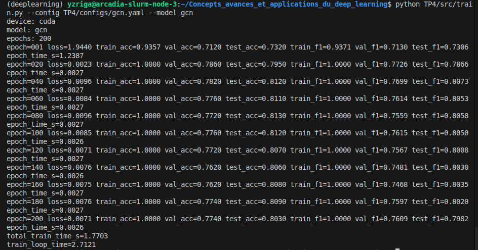
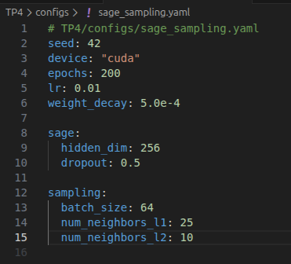
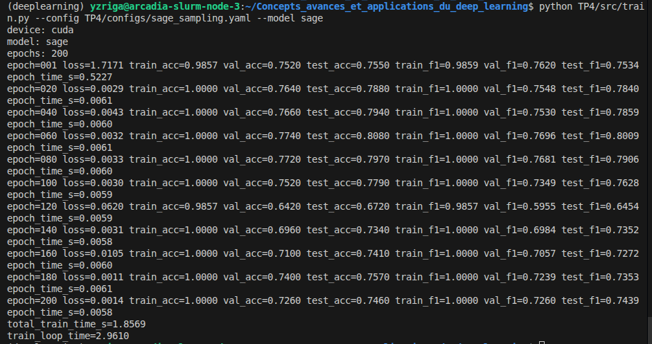

# TP4 - CI : Graph Neural Networks

## Exercice 1: Initialisation du TP et smoke test PyG (Cora)

### Structure du dépôt

### Sortie du smoke test

---
## Exercice 2 : Baseline tabulaire : MLP (features seules) + entraînement et métriques

### Résultats de la baseline MLP

---
## Exercice 3 : Baseline GNN — GCN (full-batch) + comparaison perf/temps

### Résultats GCN et comparaison MLP vs GCN

| Modèle | test_acc | test_f1 | total_train_time_s |
|--------|----------|---------|-------------------|
| MLP    | 0.5740   | 0.5634  | 5.56 s            |
| GCN    | 0.8030 | 0.7982 | 1.77 s    |

### Explication

Cora est un graphe à forte homophilie : les nœuds reliés par des arêtes appartiennent majoritairement à la même classe (papiers citant des travaux du même domaine). GCN exploite ce signal en agrégeant les features des voisins à chaque couche : après 2 couches, chaque nœud voit une représentation moyennée de son voisinage à distance 2, ce qui agit comme une propagation de label implicite.

Le MLP, lui, travaille nœud par nœud sans jamais regarder les voisins : il ne peut s'appuyer que sur le bag-of-words, qui encode le contenu mais pas le contexte relationnel. Avec seulement 140 nœuds d'entraînement, les features seules ne suffisent pas à bien discriminer les 7 classes.

GCN gagne +23 pts d'accuracy et +23 pts de F1 en étant plus rapide (1.77 s vs 5.56 s), car la propagation de message sur ce petit graphe est très légère. Le pic à 5 s pour le MLP à l'epoch 1 correspond au warm-up CUDA, pas au calcul réel.

---
## Exercice 4 : Modèle principal : GraphSAGE + neighbor sampling (mini-batch)

### Résultats GraphSAGE et comparaison finale

| Modèle     | test_acc   | test_f1    | total_train_time_s |
|------------|------------|------------|-------------------|
| MLP        | 0.5740     | 0.5634     | 5.56 s            |
| GCN        | 0.8030 | 0.7982 | 1.77 s        |
| GraphSAGE  | 0.7460     | 0.7439     | 1.86 s            |

### Explication

Le neighbor sampling restreint, pour chaque nœud cible d'un mini-batch, le nombre de voisins agrégés à un fanout fixe par couche (ici 25 pour la couche 1, 10 pour la couche 2). Cela permet de traiter un sous-graphe de taille bornée plutôt que tout le graphe à chaque itération, ce qui rend l’entraînement scalable à des graphes de millions de nœuds.

En contrepartie, chaque mise à jour du gradient est calculée sur un sous-ensemble aléatoire de voisins : le gradient est donc bruité (haute variance comparé au full-batch). Les nœuds à très fort degré (hubs) sont sur-échantillonnés en proportion, ce qui peut biaiser l’estimation locale. Un fanout trop faible (ex. 2-3) amplifie ce bruit et dégrade la convergence; un fanout élevé réduit la variance mais rapproche du coût full-batch et ajoute une latence CPU non négligeable pour le sampling lui-même.

Sur Cora (petit graphe), le bénéfice en temps est limité et la performance peut légèrement baisser par rapport au GCN full-batch. L’intérêt du sampling se manifeste surtout à grande échelle où le full-batch est infaisable en mémoire.

---
## Exercice 5: Benchmarks ingénieur : temps d’entraînement et latence d’inférence (CPU/GPU)

---
## Exercice 6: Synthèse finale : comparaison, compromis, et recommandations ingénieur