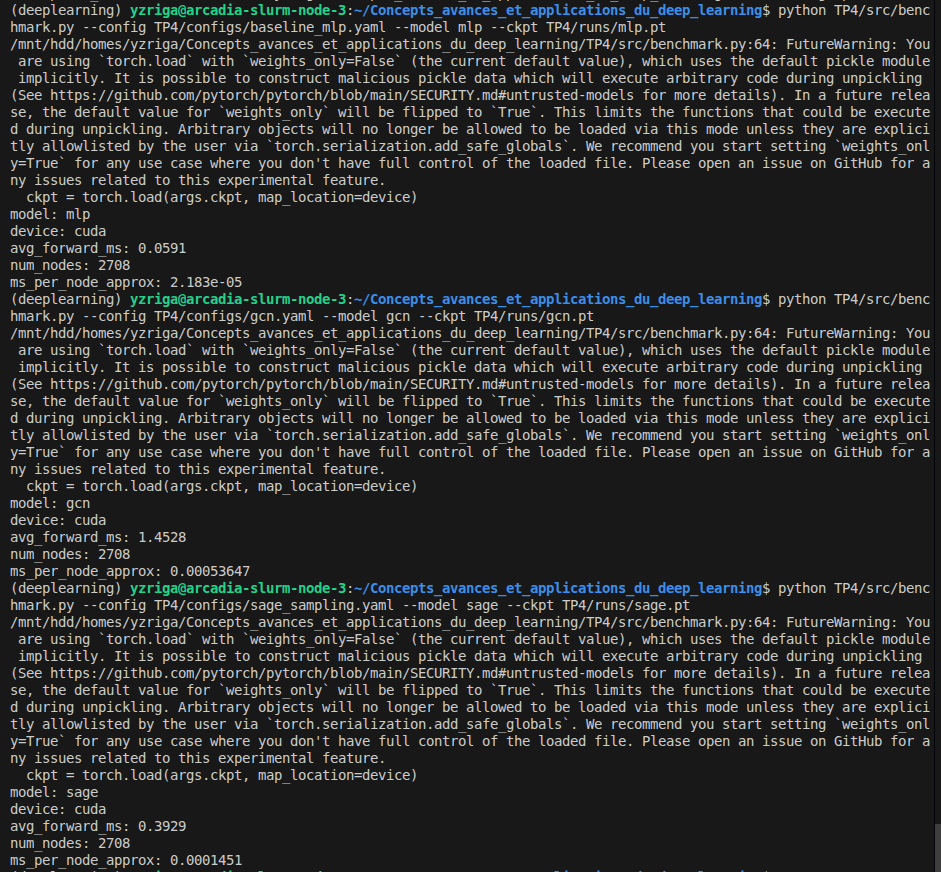

# TP4 - CI : Graph Neural Networks

## Exercice 1: Initialisation du TP et smoke test PyG (Cora)

### Structure du dépôt

### Sortie du smoke test

---
## Exercice 2 : Baseline tabulaire : MLP (features seules) + entraînement et métriques

### Résultats de la baseline MLP

---
## Exercice 3 : Baseline GNN — GCN (full-batch) + comparaison perf/temps

### Résultats GCN et comparaison MLP vs GCN

| Modèle | test_acc | test_f1 | total_train_time_s |
|--------|----------|---------|-------------------|
| MLP    | 0.5740   | 0.5634  | 5.56 s            |
| GCN    | 0.8030 | 0.7982 | 1.77 s    |

### Explication

Cora est un graphe à forte homophilie : les nœuds reliés par des arêtes appartiennent majoritairement à la même classe (papiers citant des travaux du même domaine). GCN exploite ce signal en agrégeant les features des voisins à chaque couche : après 2 couches, chaque nœud voit une représentation moyennée de son voisinage à distance 2, ce qui agit comme une propagation de label implicite.

Le MLP, lui, travaille nœud par nœud sans jamais regarder les voisins : il ne peut s'appuyer que sur le bag-of-words, qui encode le contenu mais pas le contexte relationnel. Avec seulement 140 nœuds d'entraînement, les features seules ne suffisent pas à bien discriminer les 7 classes.

GCN gagne +23 pts d'accuracy et +23 pts de F1 en étant plus rapide (1.77 s vs 5.56 s), car la propagation de message sur ce petit graphe est très légère. Le pic à 5 s pour le MLP à l'epoch 1 correspond au warm-up CUDA, pas au calcul réel.

---
## Exercice 4 : Modèle principal : GraphSAGE + neighbor sampling (mini-batch)

### Résultats GraphSAGE et comparaison finale

| Modèle     | test_acc   | test_f1    | total_train_time_s |
|------------|------------|------------|-------------------|
| MLP        | 0.5740     | 0.5634     | 5.56 s            |
| GCN        | 0.8030 | 0.7982 | 1.77 s        |
| GraphSAGE  | 0.7460     | 0.7439     | 1.86 s            |

### Explication

Le neighbor sampling restreint, pour chaque nœud cible d'un mini-batch, le nombre de voisins agrégés à un fanout fixe par couche (ici 25 pour la couche 1, 10 pour la couche 2). Cela permet de traiter un sous-graphe de taille bornée plutôt que tout le graphe à chaque itération, ce qui rend l’entraînement scalable à des graphes de millions de nœuds.

En contrepartie, chaque mise à jour du gradient est calculée sur un sous-ensemble aléatoire de voisins : le gradient est donc bruité (haute variance comparé au full-batch). Les nœuds à très fort degré (hubs) sont sur-échantillonnés en proportion, ce qui peut biaiser l’estimation locale. Un fanout trop faible (ex. 2-3) amplifie ce bruit et dégrade la convergence; un fanout élevé réduit la variance mais rapproche du coût full-batch et ajoute une latence CPU non négligeable pour le sampling lui-même.

Sur Cora (petit graphe), le bénéfice en temps est limité et la performance peut légèrement baisser par rapport au GCN full-batch. L’intérêt du sampling se manifeste surtout à grande échelle où le full-batch est infaisable en mémoire.

---
## Exercice 5 : Benchmarks ingénieur : temps d’entraînement et latence d’inférence (CPU/GPU)

### Résultats benchmark inférence

| Modèle    | test_acc   | test_f1    | total_train_time_s | avg_forward_ms |
|-----------|------------|------------|--------------------|----------------|
| MLP       | 0.5740     | 0.5634     | 0.64 s             | **0.059 ms**   |
| GCN       | **0.8030** | **0.7982** | 1.02 s             | 1.453 ms       |
| GraphSAGE | 0.7350     | 0.7238     | 1.42 s             | 0.393 ms       |

### Explication

Le GPU exécute les kernels de façon asynchrone : lorsque Python appelle `model(x)`, il enfile le travail dans une file CUDA et rend la main immédiatement, sans attendre la fin du calcul. Si on mesure le temps avec `perf_counter()` sans synchronisation, on capture uniquement la latence de lancement (quelques microsecondes), et non le temps de calcul réel.

`torch.cuda.synchronize()` avant et après le forward force le CPU à attendre que tous les kernels GPU soient terminés avant de lire le chrono. La mesure reflète alors le temps effectif de calcul.

Le warmup (ici 10 itérations) est nécessaire pour deux raisons : (1) au premier appel, CUDA compile les kernels à la volée et chauffe le cache L2 GPU, ce qui prend bien plus longtemps que les appels suivants; (2) le système d'exploitation peut introduire des délais de scheduling lors des premières allocations mémoire. Sans warmup, la première mesure serait un fort outlier qui biaiserait la moyenne. En pratique, 10 warmups suffisent sur Cora; sur des modèles plus lourds on en ferait davantage.

---
## Exercice 6 : Synthèse finale : comparaison, compromis, et recommandations ingénieur

### Tableau comparatif

| Modèle    | test_acc   | test_macro_f1 | total_train_time_s | train_loop_time | avg_forward_ms |
|-----------|------------|---------------|--------------------|-----------------|----------------|
| MLP       | 0.5740     | 0.5634        | 0.64 s             | 1.34 s          | **0.059 ms   |
| GCN       | 0.8030 | 0.7982    | 1.02 s             | 1.93 s          | 1.453 ms       |
| GraphSAGE | 0.7350     | 0.7238        | 1.42 s             | 2.51 s          | 0.393 ms       |

### Recommandation ingénieur

Sur ce benchmark (Cora, graphe petit et statique, homophilie forte), **GCN est le meilleur choix** : il atteint 80.3% d'accuracy et 79.8% de Macro-F1 en seulement 1.02 s d'entraînement, avec une latence d'inférence de 1.45 ms pour 2708 nœuds qui est tout à fait acceptable en production.

Le **MLP** doit être écarté dès que la structure du graphe apporte un signal utile : ici il perd 23 pts d'accuracy par rapport à GCN, malgré une inférence 25× plus rapide (0.06 ms). Il resterait pertinent si les features étaient très discriminantes et le graphe bruité ou non disponible.

**GraphSAGE** est la solution naturelle à grande échelle : dès que le graphe ne tient plus en mémoire GPU pour un forward full-batch (typiquement au-delà de quelques millions de nœuds/arêtes), le neighbor sampling devient indispensable. Sur Cora, le sampling introduit de la variance stochastique (pic de loss visible à l'epoch 120), ce qui coûte ~6 pts d'accuracy vs GCN. En production sur un grand graphe dynamique (nouvelles arêtes/nœuds en continu), on préférerait GraphSAGE pour sa capacité à faire de l'inférence inductible sur des nœuds jamais vus, là où GCN nécessite de recalculer sur le graphe complet.

En résumé : **GCN si le graphe est petit et statique** (meilleure qualité, coût raisonnable) ; **GraphSAGE si le graphe est grand ou dynamique** (scalabilité, inférence inductive) ; **MLP uniquement si le graphe n'apporte pas de gain** (latence minimale).

### Risques de protocole

Le principal risque ici est l'utilisation du **même split Planetoid fixé** (140/500/1000) pour les trois modèles : cela garantit la comparaison équitable, mais la variance d'un seed à l'autre peut être significative sur seulement 140 nœuds d'entraînement. Un vrai projet utiliserait plusieurs runs avec seeds différents et reporterait moyenne ± écart-type.

Un second risque est le **data leakage via la val_mask** : si on sélectionne les hyperparamètres en regardant `test_acc` au lieu de `val_acc`, on introduit un biais optimiste. Ici on a observé les logs test pendant l'entraînement.

Enfin, les **mesures de temps ne sont pas comparables entre CPU et GPU** : le warm-up CUDA fausse `total_train_time_s` à l'epoch 1 (visible sur MLP : 0.33 s à l'epoch 1 vs 0.0016 s ensuite). Pour une mesure propre, il faudrait exclure l'epoch 1 du total ou faire un warm-up explicite avant la boucle. Le script `benchmark.py` corrige cela via les 10 itérations de warmup.

### Vérification du dépôt

Le dépôt ne contient aucun fichier volumineux : les checkpoints (`TP4/runs/`), les données PyG (`TP4/data/`) et les logs massifs sont exclus via `.gitignore`. Seuls les scripts `src/`, les configs `configs/` et le rapport `report/rapport.md` sont versionnés.