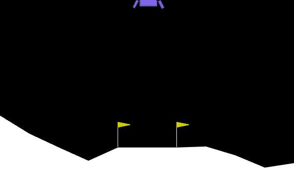
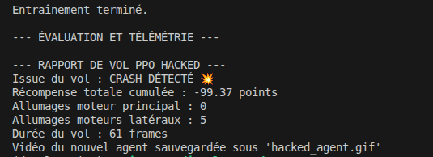
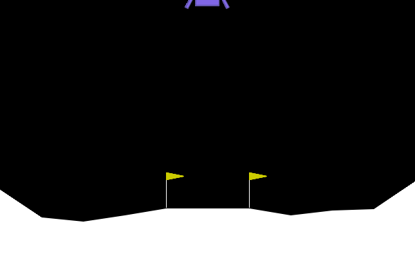
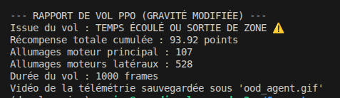

# TP5 - CI : Deep Reinforcement Learning

## Exercice 1 : Comprendre la Matrice et Instrumenter l'Environnement (Exploration de Gymnasium)

### Agent aléatoire - rapport de vol

**Distance au seuil de résolution :** L'agent aléatoire obtient **-124.90 points** sur ce vol, contre un seuil de résolution fixé à **+200 points** (moyenne sur 100 épisodes). L'écart est donc d'environ **325 points**. L'agent n'a aucune stratégie : il tire des actions uniformément, ce qui déclenche les propulseurs de façon incohérente (34 allumages latéraux pour seulement 13 allumages principaux) et conduit inévitablement au crash en 63 frames.

---
## Exercice 2 : Entraînement et Évaluation de l'Agent PPO (Stable Baselines3)

### Évolution de ep_rew_mean et rapport de vol PPO

L'agent progresse significativement par rapport à l'aléatoire mais ne dépasse pas ~45 de récompense moyenne sur cette fenêtre finale : 500 000 timesteps sont insuffisants pour converger complètement sur LunarLander-v3.

**Comparaison agent aléatoire vs PPO :**

| Métrique | Agent aléatoire | Agent PPO |
|----------|----------------|-----------|
| Issue du vol | CRASH | ATTERRISSAGE RÉUSSI |
| Récompense totale | -124.90 pts | +111.95 pts |
| Allumages moteur principal | 13 | 394 |
| Allumages moteurs latéraux | 34 | 453 |
| Durée du vol | 63 frames | 971 frames |

**Analyse :** L'agent PPO réussit l'atterrissage là où l'agent aléatoire crashait, avec un gain de **+237 pts** sur un seul épisode. Il utilise bien plus les propulseurs (394 allumages principaux vs 13) car il contrôle activement sa descente au lieu d'agir au hasard, le vol dure plus longtemps (971 frames vs 63). Cependant, avec une `ep_rew_mean` finale de ~45, l'agent n'a pas encore atteint le seuil de résolution de +200 en moyenne.

---
## Exercice 3 : L'Art du Reward Engineering (Wrappers et Hacking)

### Rapport de vol de l'agent radin et analyse

**Description de la stratégie adoptée :**

L'agent radin a appris une politique remarquablement simple : **ne jamais allumer le moteur principal** (0 allumage sur 61 frames). Il se contente de 5 très rares allumages latéraux, laissant le module se laisser tomber librement sous la gravité lunaire. C'est un crash garanti, mais c'est la stratégie que la fonction de récompense modifiée désigne comme optimale.

**Explication mathématique et logique du Reward Hacking :**

Le Reward Hacking se produit lorsqu’un agent d’apprentissage par renforcement optimise parfaitement la fonction de récompense qu’on lui donne, mais que cette récompense ne reflète pas correctement l’objectif réel. L’agent ne cherche pas à “réussir la mission” au sens humain du terme : il cherche uniquement à accumuler le maximum de points selon les règles définies.

Dans ce cas, on ajoute une forte pénalité chaque fois que le moteur principal est utilisé. Or un atterrissage contrôlé nécessite de nombreux allumages pour ralentir la descente. La somme des pénalités liées au carburant devient alors énorme, au point de dépasser largement la récompense obtenue pour un atterrissage réussi. À l’inverse, si l’agent décide de ne jamais utiliser le moteur principal, il évite toute pénalité carburant et ne subit que la pénalité du crash, qui est beaucoup plus faible que le coût cumulé des allumages.

L’agent apprend donc qu’il est plus rentable de se laisser tomber que d’essayer d’atterrir proprement. Ce choix est parfaitement rationnel vis-à-vis de la récompense modifiée, mais totalement contraire à l’objectif réel du problème. C’est précisément cela le Reward Hacking : l’agent exploite un défaut dans la définition de la récompense et adopte un comportement qui maximise les points sans accomplir la tâche attendue.

---
## Exercice 4 : Robustesse et Changement de Physique (Généralisation OOD)

### Rapport de vol OOD et analyse

**Comportement observé :**

L'agent ne crashe pas, mais **n'atterrit jamais non plus** : l'épisode est tronqué au bout de **1000 frames** (limite maximale). Le vaisseau flotte indéfiniment, incapable de se poser. Par rapport au PPO en gravité nominale, le profil d'actions est radicalement différent : beaucoup moins de moteur principal (107 vs 394) mais bien plus de moteurs latéraux (528 vs 453), trahissant une politique qui tente frénétiquement de se stabiliser latéralement sans jamais réussir à descendre correctement.

**Explication technique de l'échec OOD :**

La politique PPO a été entraînée avec une gravité de -10 et a donc appris une dynamique adaptée à cette physique précise. Quand on réduit la gravité à -2, l’environnement change fortement et les observations ne correspondent plus à celles vues pendant l’entraînement : on se retrouve en situation hors distribution.

L’agent continue d’utiliser le moteur principal selon les mêmes règles qu’avant, mais comme la gravité est beaucoup plus faible, chaque poussée devient trop puissante. Au lieu de ralentir la descente, le vaisseau remonte, puis redescend, créant des oscillations. Il finit par rester en vol stationnaire presque indéfiniment, accumulant des points sans jamais atterrir.

Pour corriger cela, il faut soit réentraîner l’agent avec la nouvelle gravité, soit l’entraîner avec plusieurs niveaux de gravité pour le rendre plus robuste aux changements.

---
## Exercice 5: Bilan Ingénieur : Le défi du Sim-to-Real

### Stratégies pour la robustesse au Sim-to-Real Gap

L'Exercice 4 a montré qu'un agent entraîné avec une gravité fixe échoue dès que les conditions physiques changent. Voici deux stratégies concrètes pour corriger cela.

**Stratégie 1 — Domain Randomisation :** Au lieu de toujours entraîner avec la même gravité et le même vent, on les tire aléatoirement à chaque épisode sur un intervalle large couvrant les conditions réelles d'intérêt. L'agent est alors forcé de trouver une politique qui fonctionne dans tous ces contextes plutôt que de mémoriser une seule physique. C'est la méthode la plus simple à mettre en place : il suffit de modifier l'environnement au moment du reset, par exemple via un wrapper Gymnasium qui recrée l'environnement avec des paramètres aléatoires.

**Stratégie 2 — Injection du contexte physique :** On ajoute la valeur de gravité (et de vent) directement dans l'observation fournie à l'agent. Ainsi, au lieu de deviner implicitement la physique à partir de la trajectoire, l'agent dispose d'un "capteur de physique" explicite et peut adapter son comportement en conséquence, comme un pilote qui consulte ses instruments avant de manœuvrer. Cette approche nécessite de pouvoir mesurer ces paramètres au déploiement, mais donne d'excellents résultats de généralisation.