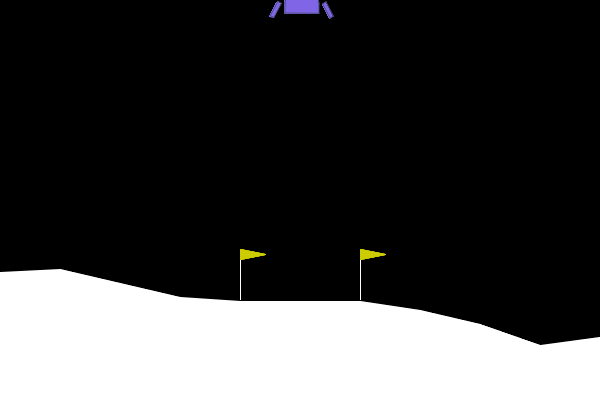
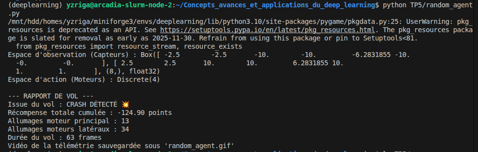
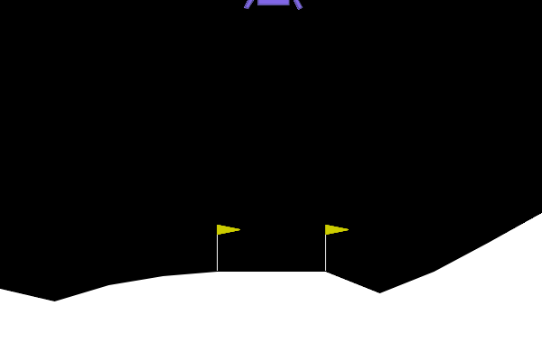
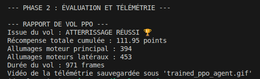

# TP5 - CI : Deep Reinforcement Learning

## Exercice 1 : Comprendre la Matrice et Instrumenter l'Environnement (Exploration de Gymnasium)

### Agent aléatoire - rapport de vol

**Distance au seuil de résolution :** L'agent aléatoire obtient **-124.90 points** sur ce vol, contre un seuil de résolution fixé à **+200 points** (moyenne sur 100 épisodes). L'écart est donc d'environ **325 points**. L'agent n'a aucune stratégie : il tire des actions uniformément, ce qui déclenche les propulseurs de façon incohérente (34 allumages latéraux pour seulement 13 allumages principaux) et conduit inévitablement au crash en 63 frames.

---
## Exercice 2 : Entraînement et Évaluation de l'Agent PPO (Stable Baselines3)

### Évolution de ep_rew_mean et rapport de vol PPO

L'agent progresse significativement par rapport à l'aléatoire mais ne dépasse pas ~45 de récompense moyenne sur cette fenêtre finale : 500 000 timesteps sont insuffisants pour converger complètement sur LunarLander-v3.

**Comparaison agent aléatoire vs PPO :**

| Métrique | Agent aléatoire | Agent PPO |
|----------|----------------|-----------|
| Issue du vol | CRASH | ATTERRISSAGE RÉUSSI |
| Récompense totale | -124.90 pts | +111.95 pts |
| Allumages moteur principal | 13 | 394 |
| Allumages moteurs latéraux | 34 | 453 |
| Durée du vol | 63 frames | 971 frames |

**Analyse :** L'agent PPO réussit l'atterrissage là où l'agent aléatoire crashait, avec un gain de **+237 pts** sur un seul épisode. Il utilise bien plus les propulseurs (394 allumages principaux vs 13) car il contrôle activement sa descente au lieu d'agir au hasard, le vol dure plus longtemps (971 frames vs 63). Cependant, avec une `ep_rew_mean` finale de ~45, l'agent n'a pas encore atteint le seuil de résolution de +200 en moyenne.

---
## Exercice 3 : Évaluation de l'agent entraîné

<!-- À compléter -->

---

## Exercice 4 : Analyse et discussion

<!-- À compléter -->
